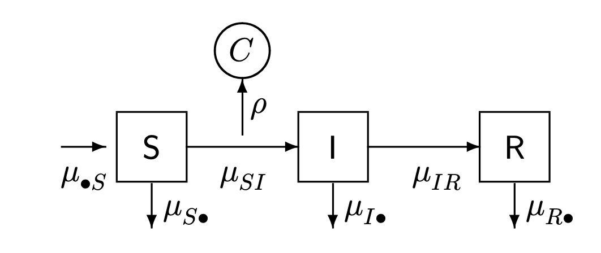
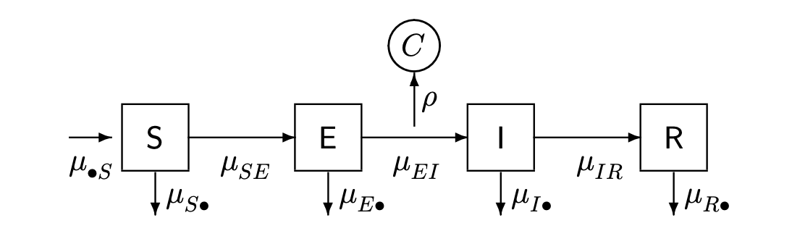

```{r setup, include=FALSE}
knitr::opts_chunk$set(echo = TRUE)
set.seed(594709947L)
library(pomp)
library(ggplot2)
library(gridExtra)
library(plyr)
library(reshape2)
theme_set(theme_bw())
```

### Compartment models

Dynamic systems can often be represented in terms of flows between compartments. We will develop the concept of a **compartment model** for which we specify rates for the flows between compartments.

A **compartment model** is a model associated with a **flow diagram** specifying how objects move between categories, called **compartments**.

One major applications of compartment models is pharmacokinetics, the study of how pharmacological drugs enter the body, move between organs, metabolize, and leave. The compartments may be the organs; the flow is movement of the drug and its metabolites between organs. Another major application of compartment models is epidemiology. Compartments are groups of people; the flow is the movement of an infectious disease through the population.

#### Compartment models in epidemiology: the SIR model and its generalizations

We will develop deterministic and stochastic representations of a susceptible-infected-recovered (SIR) system, a fundamental class of models for disease transmission dynamics.

```{r, fig.align='center', out.width = "400px", echo=FALSE}

```

\[
\begin{array}{l}
S : \text{susceptible}  \\
I : \text{infected and infectious} \\
R : \text{recovered and/or removed} \\
C : \text{cases}
\end{array}
\]

We suppose that each arrow has an associated rate, so here there is a rate $\mu_{SI}(t)$ at which individuals in $S$ transition to $I$, and $\mu_{IR}$ at which individuals in $I$ transition to $R$.

To account for demography (births/deaths/immigration/emmigration) we allow the possibility of a source and sink compartment, which is not usually represented on the flow diagram. We write $\mu_{{\small{\bullet}}S}$ for a rate of births into $S$, and denote mortality rates by $\mu_{S{\small\bullet}}$, $\mu_{I{\small\bullet}}$, $\mu_{R{\small\bullet}}$.

The rates may be either constant or varying. In particular, for a simple SIR model, the recovery rate $\mu_{IR}$ is a **constant** but the infection rate has the time-varying form \[\mu_{SI}(t)=\beta \, I(t),\] with $\beta$ being the *contact rate*. For the simplest SIR model, ignoring demography, we set \[\mu_{{\small{\bullet}}S}=\mu_{S{\small{\bullet}}}=\mu_{I{\small{\bullet}}}=\mu_{R{\small{\bullet}}}=0\]

To develop a systemtic notation, keep track of the flows between compartments as well as the number of individuals in each compartment. Let
$N_{SI}(t)$ count the number of individuals who have transitioned from $S$ to $I$ by time $t$. $N_{SI}(t)$ is a **counting process**. $N_{IR}(t)$ counts individuals transitioning from $I$ to $R$. To include demography, we could also keep track of birth and death events by the counting processes $N_{{\small{\bullet}} S}(t)$, $N_{S{\small{\bullet}}}(t)$, $N_{I{\small{\bullet}}}(t)$, $N_{R{\small{\bullet}}}(t)$. 

#### Simple counting processes

A **simple counting process** is one which cannot count more than one event at a time. Technically, the SIR Markov chain model we have written is simple.

For discrete population compartment models, the flow counting processes are non-decreasing and integer valued. For continuous population compartment models, the flow counting processes are non-decreasing and real valued.

The numbers of people in each compartment can be computed via the counting processes. Ignoring demography, we have:
\[
\begin{array}{lcl} 
S(t)&=& S(0) - N_{SI}(t) \\
I(t)&=& I(0) + N_{SI}(t) - N_{IR}(t) \\
R(t) &=& R(0) + N_{IR}(t)
\end{array}
\]

#### Ordinary differential equation (ODE) interpretation of the SIR model

Together with initial conditions specifying S(0), I(0) and R(0), we just need to write down ODEs for the flow counting processes: \[
\begin{aligned}
dN_{SI}/dt &= \mu_{SI}(t)S(t) \\
dN_{IR}/dt &= \mu_{IR}I(t)
\end{aligned}
\]

#### Simple continuous-time Markov chain interpretation of the SIR model

The Markov property lets us specify a model by the transition probabilities on small intervals (together with the initial conditions). For the SIR model, we have
\[
\begin{array}{lll}
\mathbb{P}\left[N_{S I}(t+\delta)=N_{S I}(t)+1\right] & =\mu_{S I}(t) S(t) \delta+o(\delta) \\ \mathbb{P}\left[N_{S I}(t+\delta)=N_{S I}(t)\right] & =1-\mu_{S I}(t) S(t) \delta+o(\delta) \\ \mathbb{P}\left[N_{I R}(t+\delta)=N_{I R}(t)+1\right] & =\mu_{I R} I(t) \delta+o(\delta) \\ \mathbb{P}\left[N_{I R}(t+\delta)=N_{I R}(t)\right] & =1-\mu_{I R}(t) I(t) \delta+o(\delta)
\end{array}
\]

**Little o notation**: $o(\delta)$ means $\lim_{\delta\rightarrow 0} \frac{o(\delta)}{\delta} = 0$.

Meaning of the little o notation: \[ f(x+\delta)=f(x)+\delta g(x)+o(\delta) \] is equivalent to \[\frac{d f}{d x}=g(x)\]

### Euler’s method for ODE

Goal: a numeric solution of an ODE $dx/dt = f(x)$ with an initial condition $x(0)$.

Step: 

1. Initialized the numerical solution at the known starting value, $\tilde{x}(0)=x(0)$.
2. For $k = 1,2,...,$ suppose the gradient $dx/dt$ is approximately constant over the small time interval $k \delta \leq t \leq(k+1) \delta$.
3. Let $\tilde{x}((k+1) \delta)=\tilde{x}(k \delta)+\delta f(\tilde{x}(k \delta))$

Euler’s Method will only be accurate over small increments and the function should not change too rapidly.

### Gillspie’s algorithm

A widely used, exact **simulation method** for continuous time Markov chains. 

### Compartmental models in *pomp*

```{r}
bsflu <- read.table("https://raw.githubusercontent.com/ionides/531w20/master/11/bsflu_data.txt") 
head(bsflu,5)
```

```{r fig.align='center', fig.height=3}
p1 <- ggplot(data=bsflu,aes(x=day,y=B))+geom_line()+geom_point()
p2 <- ggplot(data=bsflu,aes(x=day,y=C))+geom_line()+geom_point()
grid.arrange(p1, p2, nrow = 1)
```

The unobserved state variables, in this case, are the numbers of individuals, $S$, $I$, $R$ respectively. It is reasonable in this case to view the population size $N = S + I + R$, as fixed. The numbers that actually move from one compartment to another over any particular time interval are modeled as stochastic processes. In this case, we’ll assume that the stochasticity is purely demographic, i.e., each individual in a compartment at any given time faces the same risk of exiting the compartment.

$\mu_{IR}$ is often called $\gamma$ and $\mu_{SI}(t)$ is called $\lambda(t)$. The number of individuals, $\Delta N_{SI}$, moving from $S$ to $I$ over interval $\Delta t$ as \[\Delta N_{S I} \sim \text { Binomial }\left(S, 1-e^{-\lambda \Delta t}\right)\] and the number moving from $I$ to $R$ as \[\Delta N_{I R} \sim \text { Binomial }\left(I, 1-e^{-\gamma \Delta t}\right)\]

```{r}
sir_step <- Csnippet("
double dN_SI = rbinom(S,1-exp(-Beta*I/N*dt)); 
double dN_IR = rbinom(I,1-exp(-gamma*dt));
S -= dN_SI;
I += dN_SI - dN_IR;
R += dN_IR;
H += dN_IR;
")
```

#### Initial conditions

At day zero, we’ll assume that $I = 1$ and $R = 0$, but we don’t know how big the school is, so we treat $N$ as a parameter to be estimated and let $S(0) = N − 1$. Assume that the case reports, $B$, result from a process by which new infections result in confinement with probability $\rho$, which we can think of as the probability that an infection is severe enough to be noticed by the school authorities. Since confined cases have, presumably, a much lower transmission rate, treat $B$ as being a count of the number of boys who have moved from I to R over the course of the past day. Use a variable $H$ to track this.

```{r}
sir_rinit <- Csnippet(" 
  S = N-1;
  I = 1;
  R = 0;
  H = 0;
")
```

Fold Csnippets and the data into a pomp object:

```{r}
sir <- pomp(subset(bsflu,select=c(day,B)), time="day",t0=0,rprocess=euler(sir_step,delta.t=1/6), rinit=sir_rinit,paramnames=c("N","Beta","gamma"), statenames=c("S","I","R","H"))
```

Model $B$ as a binomial process: \[B_{t} \sim \text { Binomial }(H(t)-H(t-1), \rho)\] Since at time $t$, the variable $H$ we’ve defined will contain $H(t)$, not $H(t) − H(t − 1)$. We can overcome this by telling *pomp* that we want $H$ to be set to zero immediately following each observation. We do this by setting the zeronames argument to *pomp*:

```{r}
sir <- pomp(sir,zeronames="H")
```

Include `dmeasure` and `rmeasure` component:
```{r}
dmeas <- Csnippet("lik = dbinom(B,H,rho,give_log);") 
rmeas <- Csnippet("B = rbinom(H,rho);")
sir <- pomp(sir,rmeasure=rmeas,dmeasure=dmeas,statenames="H",paramnames="rho")
```

We need some parameters as a starting point to perform simulations. We can use the final-size equation \[R_{0}=-\frac{\log (1-f)}{f}\] where $f = R(\infty)/N$ is the final size of the epidemic, together with the idea that $R_0$ must be, i.e., around 1.5, to estimate that $f \approx 0.6$, whence $N \approx 2600$.

```{r,fig.align='center', fig.height=3}
sims <- simulate(sir,params=c(Beta=1.5,gamma=1,rho=0.9,N=2600), nsim=20,format="data.frame",include=TRUE)
ggplot(sims,mapping=aes(x=day,y=B,group=.id,color=.id=="data"))+ geom_line()+guides(color=FALSE)
```

### SIR model with latency: The SEIR model

SEIR model differs from the SIR model in that infected individuals must pass a period of latency before becoming infectious.

```{r, fig.align='center', out.width = "400px", echo=FALSE}

```

In the preceding, we assumed that $B_t$ represents the number of boys sent to bed on day $t$. In fact, $B_t$ represents the total number of boys in bed on day $t$. Boys were confined for more than one day, so the data count each infection multiple times (on different days).


